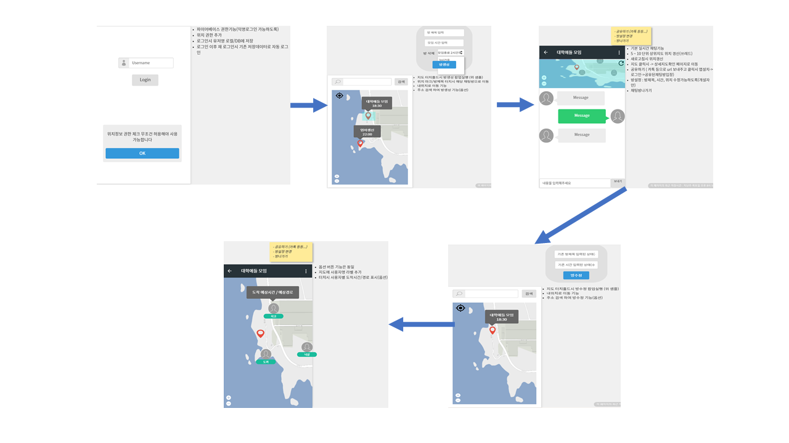

# 어디야
    비회원 기반의 채팅 / 위치조회 서비스
    Google Play Store link : https://play.google.com/store/apps/details?id=a.daehoshin.com.locationsharechat
    
1. 주요기능
    - 익명 로그인 : Firebase authentication
    - 친구초대(url) 기능 : Firebase dynamic link
    - 실시간 채팅 : Firebase realtime database
    - 실시간 위치 조회 : Google map / Location service

2. 데이터 구조 설계도
    

3. 데이터 구조 예시
    

4. 초기 와이어 프레임
    

5. IA [(다운로드)](documents/어디야IA.xlsx)

6. 시연영상
    - 로그인 : https://youtu.be/MY60Gm6d4lY
    - 자동로그인 / 방생성 : https://youtu.be/_pF1xCIxda8
    - 채팅 : https://youtu.be/PXd2jzUsDr8
    - 위치조회 : https://youtu.be/d9VAV1NWoUI
    - 기타기능 : https://youtu.be/PFzgMrhSaO8
